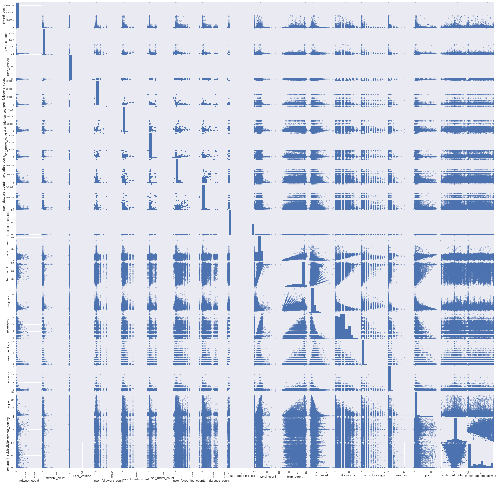
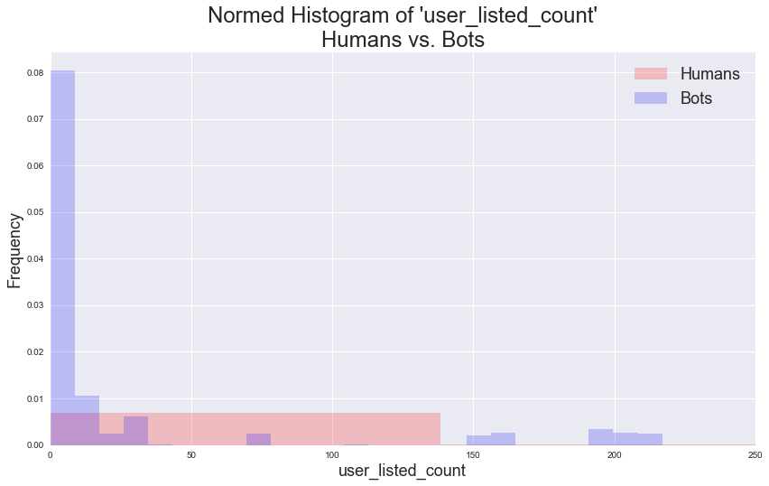
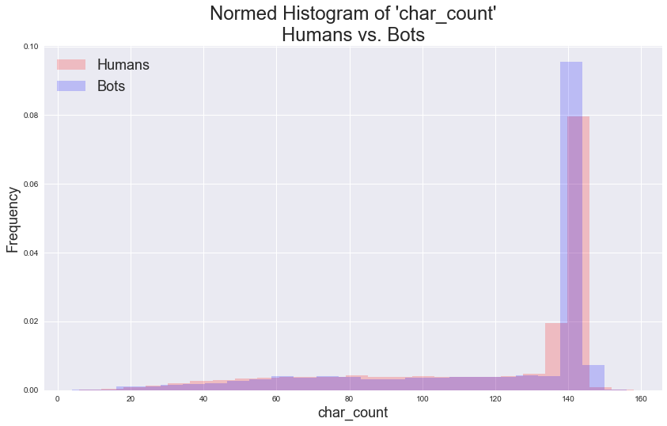
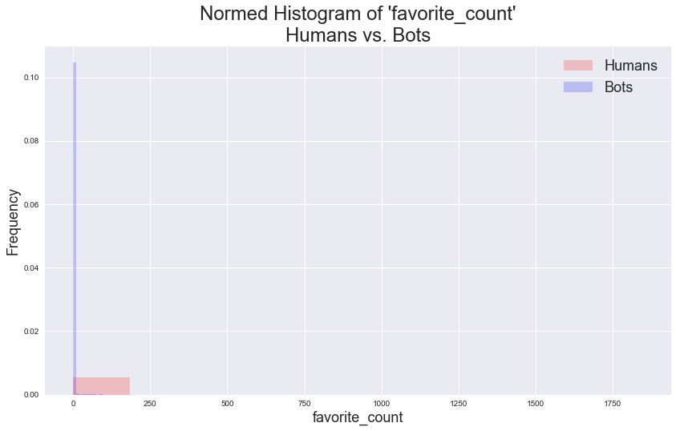
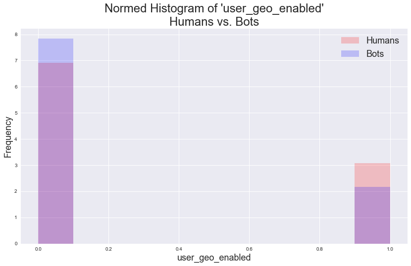
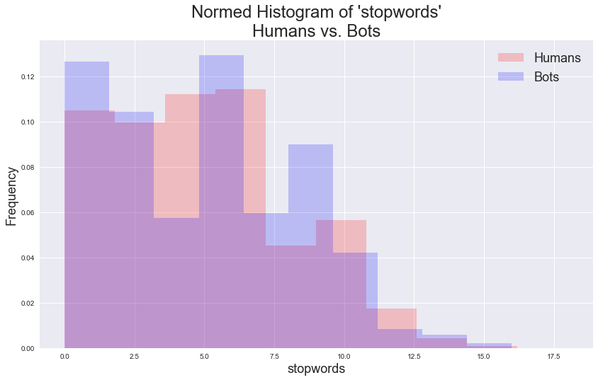
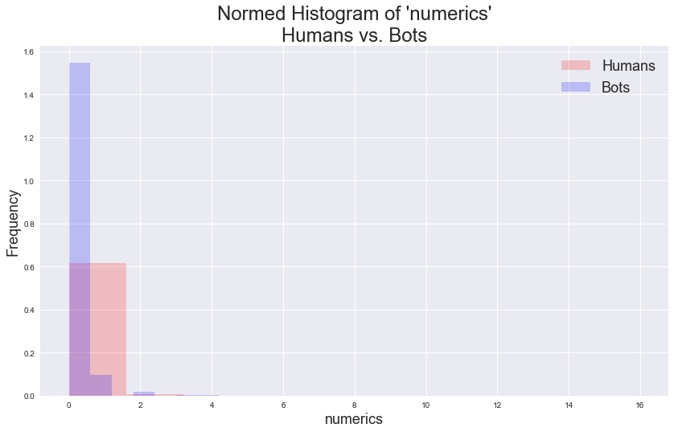
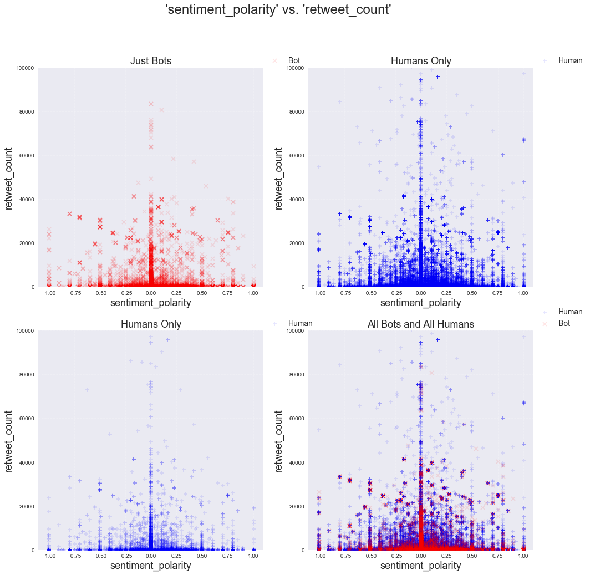
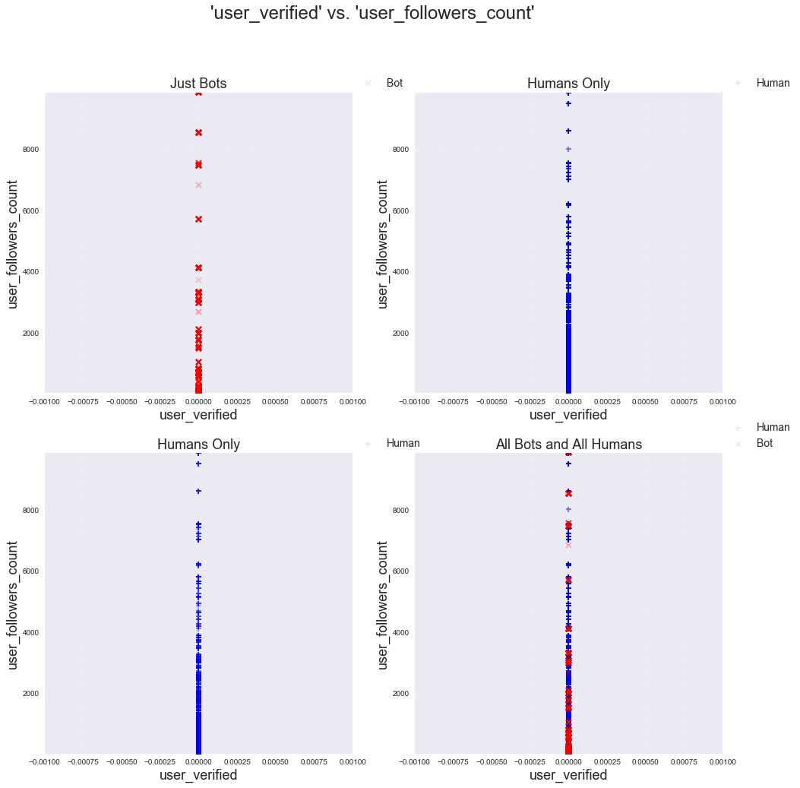
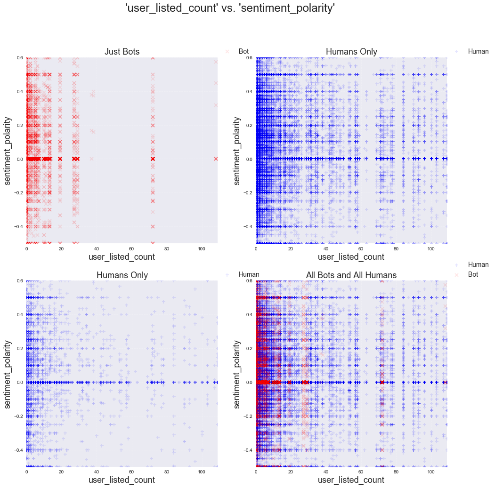

### S109A Final Project Submission Group 22 (Project Website: http://mathuser0.github.io)

Christopher Lee, chl2967@g.harvard.edu  
Sriganesh Pera, srp124@g.harvard.edu  
Bo Shang, bshang@g.harvard.edu
    
****


# Part 4. EDA Visualizations and Remarks

[Custom Functions](#custom)  
[Scatter Matrix](#scatter)  
[Histograms](#histograms)  
[Scatter Plots](#scatter)  


```python
# Basic tools
import warnings
warnings.filterwarnings('ignore')
import numpy as np
import pandas as pd
import matplotlib
import matplotlib.pyplot as plt
from pandas.plotting import scatter_matrix

%matplotlib inline
```

# <a id='custom'> Custom Functions</a>


```python
# Load csv file into Dataframe and split into features and labels
def split_X_y(filename):
    # Read csv files in to pandas dataframe
    df=pd.read_csv(filename,index_col=0)
    
    # return DataFrame object with labels dropped, and a Series object of labels
    return df.drop('bot_or_not',axis=1), df.bot_or_not


# Plot histogram comparison of Bots vs Humans 
def hist_bot_vs_hum(predictor, title=None, bins=25, normed=True, 
                    xmin=None,xmax=None, ymin=None,ymax=None):
    fig, ax = plt.subplots(figsize=(14,8))
    if title:
        ax.set_title(title, fontsize=24)
    else:
        ax.set_title("Normed Histogram of '"+predictor+"'\nHumans vs. Bots", fontsize=24)
    
    if (xmin!=None) & (xmax!=None):
        ax.set_xlim(xmin,xmax)
    
    if (ymin!=None) & (ymax!=None):
        ax.set_ylim(ymin,ymax)
    
    if normed:
        ax.set_ylabel("Frequency", fontsize=18)
    else:
        ax.set_ylabel("Counts", fontsize = 18)
        
    ax.hist(hum_X_train[predictor], bins=bins, normed=normed, 
            label="Humans", color='r', alpha = 0.2)
    
    ax.hist(bot_X_train[predictor], bins=bins, normed=normed, 
            label="Bots", color='b', alpha = 0.2)

    ax.set_xlabel(predictor, fontsize=18)
    
    ax.grid(True, '--',alpha=0.2)
    ax.legend(fontsize=18, loc='best')
    
    

# Create four scatterplots based on col1 and col2
# Top-Left       : All Humans Data
# Top-Right      : All Bots Data
# Bottom-Left    : All Humans and All Bots
# Bottom-Right   : All Bots and Equal Number of Humans (randomly sampled)
def visual_bot_vs_hum(col1,col2, xmin=None, xmax=None,ymin=None,ymax=None):
    fig,ax=plt.subplots(2,2,figsize=(16,16))
    fax=ax.ravel()
    
    fig.suptitle("'"+col1+"' vs. '"+col2+"'", fontsize=24)
    prop_sample=resample(hum_X_train, replace=False, n_samples=len(bot_X_train))

       
    fax[0].scatter(bot_X_train[col1],bot_X_train[col2],
               marker='x', alpha=0.1, color='r', label='Bot')
    fax[0].set_title("Just Bots", fontsize=18)
    
    
    fax[1].scatter(hum_X_train[col1],hum_X_train[col2],
               marker='+', alpha=0.1, color='b', label="Human")
    fax[1].set_title("Humans Only", fontsize=18)
    
        
    fax[2].scatter(prop_sample[col1],prop_sample[col2],
               marker='+', alpha=0.1, color='b', label="Human")
    fax[2].set_title("Humans Only", fontsize=18)

    
    fax[3].scatter(hum_X_train[col1],hum_X_train[col2], 
               marker='+', alpha=0.1, color='b', label="Human")
    fax[3].scatter(bot_X_train[col1],bot_X_train[col2], 
               marker='x', alpha=0.1, color='r', label='Bot')
    fax[3].set_title("All Bots and All Humans", fontsize=18)
    
    
    for i in range(4):
        fax[i].legend(fontsize=14,loc=(1,1))
        fax[i].grid(True, alpha=0.2, ls='--')
        fax[i].set_xlabel(col1, fontsize=18)
        fax[i].set_ylabel(col2, fontsize=18)
        if (xmin==None) & (xmax==None):
            fax[i].set_xlim(np.percentile(hum_X_train[col1], 5), np.percentile(hum_X_train[col1],95))
        else:
            fax[i].set_xlim(min(0,xmin),xmax)
        if (ymin==None) & (ymax==None):
            fax[i].set_ylim(np.percentile(hum_X_train[col2], 5), np.percentile(hum_X_train[col2],95))        
        else:
            fax[i].set_ylim(min(0,ymin),ymax)
        
        

    
```


```python
X_train, y_train = split_X_y("BASELINE_train.csv")
```


```python
hum_X_train = X_train.loc[y_train[y_train==0].index]
hum_y_train = y_train.loc[y_train[y_train==0].index]

bot_X_train = X_train.loc[y_train[y_train==1].index]
bot_y_train = y_train.loc[y_train[y_train==1].index]


columns= hum_X_train.columns
len(columns)
```


    18


# <a id='scatter'> Scatter Matrix </a> 


```python
scatter_matrix(hum_X_train, figsize=(30,30));
```





# <a id='histograms'> Histograms </a> 


```python
hist_bot_vs_hum('user_listed_count', 
                bins=25,normed=True, xmin=0, xmax=250)
```





#### The plot above shows a stark difference between bots and humans in their list joining behavior. Bots seem to either join no lists or join a bunch with few inbetween. Also, humans show a densely spread out distribution in number of lists joined, whereas bots seem to often take on similar number of lists joined. Keep in mind that we are looking at almost 90,000 observations here, so even a small bar here can be quite large in absolute count.  

----


```python
hist_bot_vs_hum('char_count',normed=True)
```





#### Given that tweets have a 140-character limit, bots might be taking better care to ensure that their tweets stay within the allowed character limits. Perhaps a bit better than humans do. Although both humans and bots are towards the far end of the spectrum in terms of character counts per tweet, there seems to be some possible different in behavior. Judging from this histogram plot, it seem that bots are more controlled in staying within the 140 char limit. Notice how the 2nd highest bar is on the right side (more characters) of the highest bar, which might be suggestive of bots being able to approach the 140 char limit with more ease or certainty than humans, who, in contract to the bots in this plot, have the 2nd hightest bar to the left of the maximum height bar, which, for similar reasons, may be indicative of humans being more or less afraid to approach the 140 char limit as  they write (perhaps out of fear that a message cut in the middle of a sentence is much worse than a message cut short.

----


```python
hist_bot_vs_hum(columns[1],normed=True)
```





```python
hist_bot_vs_hum(columns[2],normed=True)
```


#### The plot above 'user_verified' is an indicator variable. This plot interestingly shows that bots never verify their accounts. (100% were not verified. Perhaps this is due to it being impossible for bots to verify their accounts. The reason for this 100% same behavior should be further explored or an explanation found in future works.

----


```python
hist_bot_vs_hum(columns[3],normed=True)
```


```python
hist_bot_vs_hum(columns[4],normed=True)
```


```python
hist_bot_vs_hum(columns[6],normed=True)
```


```python
hist_bot_vs_hum(columns[7],normed=True)
```


#### (Regarding the plot above) There is a noticeable different in the distribution of humans and bots here. Future work may find it worthwhile to expland on the number of statuses. Bots seem to behave in a much more discrete way than humans do (see more on this in the plots below.)

----


```python
hist_bot_vs_hum(columns[8],normed=True)
```





```python
hist_bot_vs_hum(columns[9],normed=True)
```


```python
hist_bot_vs_hum(columns[10],normed=True)
```


```python
hist_bot_vs_hum(columns[11],normed=True)
```


#### (Regarding the plot above) The distribution of average word length looks to be similar between bots and humans. This suggests that bots are capable of creating sentences that closely resemble human created sentences.

----


```python
hist_bot_vs_hum(columns[12],normed=True)
```





#### (Regarding the plot above) Bots seem to be better at keeping the number of stopwords at a minimum. This may be because bots are mindful of the 140 character space. 

----


```python
hist_bot_vs_hum(columns[13],normed=True)
```


```python
hist_bot_vs_hum(columns[14],normed=True)
```





```python
hist_bot_vs_hum(columns[15],normed=True, xmin=-1,xmax=15)
```


#### (Regarding plot above) Bots show a trend of using at least one upper-case word in their tweets. Humans, on the other hand usually do not use any upper case words in their tweets. 

----


```python
hist_bot_vs_hum(columns[16],normed=True)
```


#### (Regarding the plot above) This plot shows how similar the distributions of our sentiment predictors are for humans and bots. Figure 30 also shows a strikingly similar distribution. 

----


```python
hist_bot_vs_hum(columns[17],normed=True)
```


#### (Regarding the plot above) That the distributions are so similar may suggest that sentiment polarity and sentiment subjectivity may not be well suited for discerning bots from humans.


----


# <a id='scatter'> Scatter Plots </a> 

## Sentiment Polarity vs. Retweet Count

These plots are shown here in order to point out that humans have tweets of sentiment polarity equal or close to 1 that have been retweeted more than 60,000 times (upper right region of top-right plot), which may be considered having gone viral. Bots, on the other hand show the same region as being empty (consider same region in top-left plot). This may suggest that bots are unable or perhaps unwilling to generate a tweet of positive polarity, thus resulting in no viral tweets in the same region in the plot. 


```python
visual_bot_vs_hum('sentiment_polarity','retweet_count', xmin=-1.1, xmax=1.1, ymin=0,ymax=100000)
```





----

----

## Stopwords vs Averge Number of Words

The number of stopwords in relation to average word length seems to be more tightly distributed for bots than for humans. This may be indicative of how machines calculate their tweets. 


```python
visual_bot_vs_hum('avg_word','stopwords', xmin=-0.1, xmax=20.1, ymin=-0.1,ymax=20)
```


----

## Retweet Count vs. User Statuses Count

There seems to be discrete levels in bots for the y-axis, whereas humans show a continuous distribution. The implications of the number of followers a user has should be looked into further for coordinated efforts made by Twitter accounts controlled by a single group or user.


```python
visual_bot_vs_hum(columns[0],columns[7])
```


----
## Verified User Status vs. Number of Followers

There seems to be discrete levels to the number of tweets (statuses) bots create. Comparing the left plots (top and bottom), it can be seen that the number of tweets created by bots take on discrete levels (see top left y-axis in red), whereas human created tweets are in numbers that densely populate the entire range. This may be due to coordinated activity by bots controlled by a single group of actors. It might be worthwhile looking into whether each discrete level corresponds to the same group of Twitter users, which, if verified, would strongly indicate that a single user controls them all.


```python
visual_bot_vs_hum(columns[2],columns[3])
```





----
## User's lists count vs. Sentiment Polarity

Notice the vertical bands shown in the top-left plot. There is an especially distinct vertical band at approximately 70 for user_listed_count. This band seems to be unique to bots as humans do not show much of a vertical pattern. It may be worthwhile looking into. 


```python
visual_bot_vs_hum(columns[5],columns[16])
```





----

## User's Lists Count vs. Sentiment Subjectivity

Notice the same vertical bands shown here again in the top-left plot. There is an especially distinct vertical band at approximately 70 for user_listed_count. This band seems to be unique to bots as humans do not show much of a vertical pattern. 


```python
visual_bot_vs_hum(columns[5],columns[17])
```


