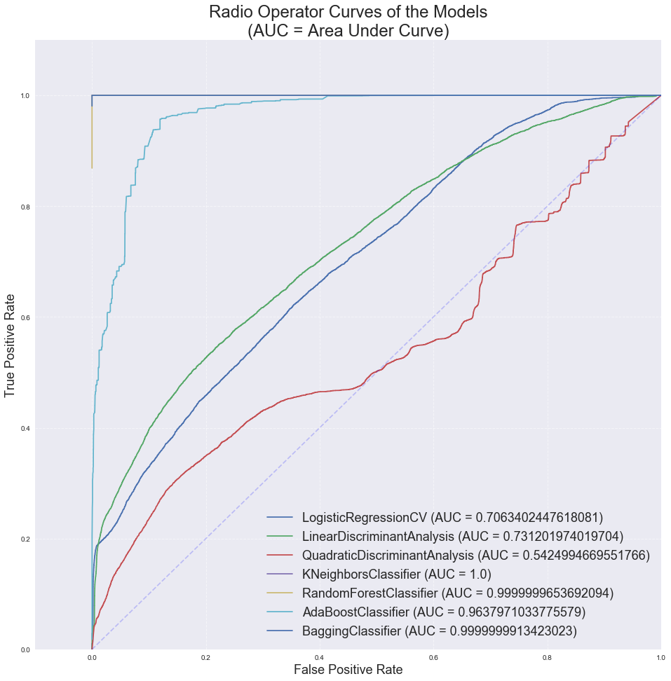

# Libraries


```python
# Basic tools
import warnings
warnings.filterwarnings('ignore')
import numpy as np
import pandas as pd
import matplotlib
import matplotlib.pyplot as plt
import seaborn as sns
from pandas.plotting import scatter_matrix
%matplotlib inline
from IPython.display import display
import nbconvert

# Preprocessing tools
from sklearn.preprocessing  import PolynomialFeatures
from sklearn.preprocessing  import StandardScaler
from sklearn.preprocessing  import Imputer

# Metrics tools
from sklearn                import metrics
from sklearn.metrics        import confusion_matrix
from sklearn.metrics        import mean_squared_error
from sklearn.metrics        import accuracy_score
from sklearn.metrics        import precision_score
from sklearn.metrics        import recall_score
from sklearn.metrics        import f1_score
from sklearn.metrics        import confusion_matrix
from sklearn.metrics        import r2_score

# Discriminant Analysis
from sklearn.discriminant_analysis import LinearDiscriminantAnalysis
from sklearn.discriminant_analysis import QuadraticDiscriminantAnalysis

# Model selection tools
from sklearn.model_selection import cross_val_score
from sklearn.model_selection import KFold
from sklearn.model_selection import train_test_split

# Linear Regression Models
from sklearn.linear_model    import Ridge
from sklearn.linear_model    import Lasso
from sklearn.linear_model    import RidgeCV
from sklearn.linear_model    import LassoCV
from sklearn.linear_model    import LinearRegression
from sklearn.linear_model    import SGDClassifier
from sklearn.linear_model    import LogisticRegression
from sklearn.linear_model    import LogisticRegressionCV

# Neighbors Classifiers
from sklearn.neighbors       import KNeighborsClassifier
from sklearn.neighbors       import RadiusNeighborsClassifier

# Tree Classifiers
from sklearn.tree            import DecisionTreeClassifier
from sklearn.tree            import ExtraTreeClassifier

# Classification Ensemble Methods
from sklearn.ensemble        import RandomForestClassifier
from sklearn.ensemble        import AdaBoostClassifier
from sklearn.ensemble        import BaggingClassifier
from sklearn.ensemble        import GradientBoostingClassifier
from sklearn.ensemble        import VotingClassifier
from sklearn.neural_network  import MLPClassifier

```

# Custom Functions


```python
# Load csv file into Dataframe and split into features and labels
def split_X_y(filename):
    # Read csv files in to pandas dataframe
    df=pd.read_csv(filename,index_col=0)

    # return DataFrame object with labels dropped, and a Series object of labels
    return df.drop('bot_or_not',axis=1), df.bot_or_not


def get_scores(model):
    '''
    Function: Displays the following:
        Accuracy Score, Precision Score, Recall Score, F1 Score,
        Training Set Confusion Matrix, Test Set Confusion Matrix

    Input: a fitted classification model

    Output: None
    '''

    print("------" + str(model.__class__).split('.')[-1].split("'")[0]+ "--------\n")
    print("-----------------------------------\nModel Scores")    

    # Create dataframe of accuracy, precision, recall, and F1 scores for training and test sets
    df = pd.DataFrame(index=['Accuracy','Precision','Recall','F1'], columns=['Training','Test'])

    # These are the scores we want to know
    scores = [accuracy_score, precision_score, recall_score, f1_score]

    # Loading scores into columns
    df['Training']=np.array([score(y_train, model.predict(X_train)) for score in scores])
    df['Test']=np.array([score(y_test, model.predict(X_test)) for score in scores])

    # Display the dataframe
    display(df)
    print("-----------------------------------")    

    # Display Confusion Matrix of training set
    show_confusion(model, train=True)

    # Display Confusion Matrix of test set
    show_confusion(model, train=False)

    # Mark the end of current model analysis
    print("------" + str(model.__class__).split('.')[-1].split("'")[0]+ "--------\n")


# Create a confusion matrix dataframe, display it, and return it
def show_confusion(model, train=False):
    '''
    Function: Displays a confusion matrix

    Input: a fitted classification model for the confusion matrix
           a boolean indicating whether to show training (default) or test confusion matrix

    Output: None
    '''
    # If train=True, then use training set, otherwise use test set
    if train:
        dataset=(X_train,y_train)
        print("Training Set Confusion Matrix")
    else:
        dataset=(X_test,y_test)
        print("Test Set Confusion Matrix")

    # Create DataFrame with Confusion Matrix
    df = pd.DataFrame(confusion_matrix(dataset[1], model.predict(dataset[0])),
                      index=['Predicted True','Predicted False'],
                      columns=['True','False'], )

    # Display Confusion Matrix
    display(df)  

    print("-----------------------------------\n")


```


```python
# Load and split training set into features and labels
X_train, y_train = split_X_y("BASELINE_train.csv")

# Load and split test set into features and labels
X_test, y_test = split_X_y("BASELINE_test.csv")
```

# Trivial Model


```python
# Trivial model predicts 0 for all inputs
trv = np.zeros(len(y_train))
trv_test = np.zeros(len(y_test))

# Creating Trivial Classification Scores DataFrame
df_trivial = pd.DataFrame(index=['Accuracy','Precision','Recall','F1'], columns=['Training','Test'])
scores = [accuracy_score, precision_score, recall_score, f1_score]
df_trivial['Training']=np.array( [score(y_train, np.zeros(len(y_train))) for score in scores ] )
df_trivial['Test']=np.array([score(y_test, np.zeros(len(y_test))) for score in scores])

# Displaying Trivial model performance data
print("------------------------------------------")
print("Classification Scores for Trivial Predictions")
display(df_trivial)
print("------------------------------------------")
print("Trivial Confusion Matrix for Training Data")
display(pd.DataFrame(confusion_matrix(y_train, np.zeros(len(y_train))),
             index=['Predicted True','Predicted False'],
             columns=['True','False']))
print("------------------------------------------")
print("Trivial Confusion Matrix for Test Data")
display(pd.DataFrame(confusion_matrix(y_test, np.zeros(len(y_test))),
             index=['Predicted True','Predicted False'],
             columns=['True','False']))
```

    ------------------------------------------
    Classification Scores for Trivial Predictions


<div>
<style scoped>
    .dataframe tbody tr th:only-of-type {
        vertical-align: middle;
    }

    .dataframe tbody tr th {
        vertical-align: top;
    }

    .dataframe thead th {
        text-align: right;
    }
</style>
<table border="1" class="dataframe">
  <thead>
    <tr style="text-align: right;">
      <th></th>
      <th>Training</th>
      <th>Test</th>
    </tr>
  </thead>
  <tbody>
    <tr>
      <th>Accuracy</th>
      <td>0.893864</td>
      <td>0.890213</td>
    </tr>
    <tr>
      <th>Precision</th>
      <td>0.000000</td>
      <td>0.000000</td>
    </tr>
    <tr>
      <th>Recall</th>
      <td>0.000000</td>
      <td>0.000000</td>
    </tr>
    <tr>
      <th>F1</th>
      <td>0.000000</td>
      <td>0.000000</td>
    </tr>
  </tbody>
</table>
</div>


    ------------------------------------------
    Trivial Confusion Matrix for Training Data


<div>
<style scoped>
    .dataframe tbody tr th:only-of-type {
        vertical-align: middle;
    }

    .dataframe tbody tr th {
        vertical-align: top;
    }

    .dataframe thead th {
        text-align: right;
    }
</style>
<table border="1" class="dataframe">
  <thead>
    <tr style="text-align: right;">
      <th></th>
      <th>True</th>
      <th>False</th>
    </tr>
  </thead>
  <tbody>
    <tr>
      <th>Predicted True</th>
      <td>66162</td>
      <td>0</td>
    </tr>
    <tr>
      <th>Predicted False</th>
      <td>7856</td>
      <td>0</td>
    </tr>
  </tbody>
</table>
</div>


    ------------------------------------------
    Trivial Confusion Matrix for Test Data


<div>
<style scoped>
    .dataframe tbody tr th:only-of-type {
        vertical-align: middle;
    }

    .dataframe tbody tr th {
        vertical-align: top;
    }

    .dataframe thead th {
        text-align: right;
    }
</style>
<table border="1" class="dataframe">
  <thead>
    <tr style="text-align: right;">
      <th></th>
      <th>True</th>
      <th>False</th>
    </tr>
  </thead>
  <tbody>
    <tr>
      <th>Predicted True</th>
      <td>7322</td>
      <td>0</td>
    </tr>
    <tr>
      <th>Predicted False</th>
      <td>903</td>
      <td>0</td>
    </tr>
  </tbody>
</table>
</div>


----

# Logit Classifier - Baseline Model


```python
# Binomial logit model construction
lgt = LogisticRegressionCV().fit(X_train,y_train)

# Binomial logit model scores
get_scores(lgt)
```

    ------LogisticRegressionCV--------

    -----------------------------------
    Model Scores


<div>
<style scoped>
    .dataframe tbody tr th:only-of-type {
        vertical-align: middle;
    }

    .dataframe tbody tr th {
        vertical-align: top;
    }

    .dataframe thead th {
        text-align: right;
    }
</style>
<table border="1" class="dataframe">
  <thead>
    <tr style="text-align: right;">
      <th></th>
      <th>Training</th>
      <th>Test</th>
    </tr>
  </thead>
  <tbody>
    <tr>
      <th>Accuracy</th>
      <td>0.906307</td>
      <td>0.903830</td>
    </tr>
    <tr>
      <th>Precision</th>
      <td>0.858924</td>
      <td>0.845679</td>
    </tr>
    <tr>
      <th>Recall</th>
      <td>0.140275</td>
      <td>0.151717</td>
    </tr>
    <tr>
      <th>F1</th>
      <td>0.241164</td>
      <td>0.257277</td>
    </tr>
  </tbody>
</table>
</div>


    -----------------------------------
    Training Set Confusion Matrix


<div>
<style scoped>
    .dataframe tbody tr th:only-of-type {
        vertical-align: middle;
    }

    .dataframe tbody tr th {
        vertical-align: top;
    }

    .dataframe thead th {
        text-align: right;
    }
</style>
<table border="1" class="dataframe">
  <thead>
    <tr style="text-align: right;">
      <th></th>
      <th>True</th>
      <th>False</th>
    </tr>
  </thead>
  <tbody>
    <tr>
      <th>Predicted True</th>
      <td>65981</td>
      <td>181</td>
    </tr>
    <tr>
      <th>Predicted False</th>
      <td>6754</td>
      <td>1102</td>
    </tr>
  </tbody>
</table>
</div>


    -----------------------------------

    Test Set Confusion Matrix


<div>
<style scoped>
    .dataframe tbody tr th:only-of-type {
        vertical-align: middle;
    }

    .dataframe tbody tr th {
        vertical-align: top;
    }

    .dataframe thead th {
        text-align: right;
    }
</style>
<table border="1" class="dataframe">
  <thead>
    <tr style="text-align: right;">
      <th></th>
      <th>True</th>
      <th>False</th>
    </tr>
  </thead>
  <tbody>
    <tr>
      <th>Predicted True</th>
      <td>7297</td>
      <td>25</td>
    </tr>
    <tr>
      <th>Predicted False</th>
      <td>766</td>
      <td>137</td>
    </tr>
  </tbody>
</table>
</div>


    -----------------------------------

    ------LogisticRegressionCV--------


----

----

## LDA


```python
lda = LinearDiscriminantAnalysis().fit(X_train, y_train)
get_scores(lda)
```

    ------LinearDiscriminantAnalysis--------

    -----------------------------------
    Model Scores


<div>
<style scoped>
    .dataframe tbody tr th:only-of-type {
        vertical-align: middle;
    }

    .dataframe tbody tr th {
        vertical-align: top;
    }

    .dataframe thead th {
        text-align: right;
    }
</style>
<table border="1" class="dataframe">
  <thead>
    <tr style="text-align: right;">
      <th></th>
      <th>Training</th>
      <th>Test</th>
    </tr>
  </thead>
  <tbody>
    <tr>
      <th>Accuracy</th>
      <td>0.902091</td>
      <td>0.899331</td>
    </tr>
    <tr>
      <th>Precision</th>
      <td>0.726058</td>
      <td>0.724551</td>
    </tr>
    <tr>
      <th>Recall</th>
      <td>0.124491</td>
      <td>0.133998</td>
    </tr>
    <tr>
      <th>F1</th>
      <td>0.212539</td>
      <td>0.226168</td>
    </tr>
  </tbody>
</table>
</div>


    -----------------------------------
    Training Set Confusion Matrix


<div>
<style scoped>
    .dataframe tbody tr th:only-of-type {
        vertical-align: middle;
    }

    .dataframe tbody tr th {
        vertical-align: top;
    }

    .dataframe thead th {
        text-align: right;
    }
</style>
<table border="1" class="dataframe">
  <thead>
    <tr style="text-align: right;">
      <th></th>
      <th>True</th>
      <th>False</th>
    </tr>
  </thead>
  <tbody>
    <tr>
      <th>Predicted True</th>
      <td>65793</td>
      <td>369</td>
    </tr>
    <tr>
      <th>Predicted False</th>
      <td>6878</td>
      <td>978</td>
    </tr>
  </tbody>
</table>
</div>


    -----------------------------------

    Test Set Confusion Matrix


<div>
<style scoped>
    .dataframe tbody tr th:only-of-type {
        vertical-align: middle;
    }

    .dataframe tbody tr th {
        vertical-align: top;
    }

    .dataframe thead th {
        text-align: right;
    }
</style>
<table border="1" class="dataframe">
  <thead>
    <tr style="text-align: right;">
      <th></th>
      <th>True</th>
      <th>False</th>
    </tr>
  </thead>
  <tbody>
    <tr>
      <th>Predicted True</th>
      <td>7276</td>
      <td>46</td>
    </tr>
    <tr>
      <th>Predicted False</th>
      <td>782</td>
      <td>121</td>
    </tr>
  </tbody>
</table>
</div>


    -----------------------------------

    ------LinearDiscriminantAnalysis--------


## Quadratic Discriminant Analysis


```python
qda = QuadraticDiscriminantAnalysis().fit(X_train, y_train)
get_scores(qda)
```

    ------QuadraticDiscriminantAnalysis--------

    -----------------------------------
    Model Scores


<div>
<style scoped>
    .dataframe tbody tr th:only-of-type {
        vertical-align: middle;
    }

    .dataframe tbody tr th {
        vertical-align: top;
    }

    .dataframe thead th {
        text-align: right;
    }
</style>
<table border="1" class="dataframe">
  <thead>
    <tr style="text-align: right;">
      <th></th>
      <th>Training</th>
      <th>Test</th>
    </tr>
  </thead>
  <tbody>
    <tr>
      <th>Accuracy</th>
      <td>0.351496</td>
      <td>0.341763</td>
    </tr>
    <tr>
      <th>Precision</th>
      <td>0.104833</td>
      <td>0.102555</td>
    </tr>
    <tr>
      <th>Recall</th>
      <td>0.677826</td>
      <td>0.644518</td>
    </tr>
    <tr>
      <th>F1</th>
      <td>0.181583</td>
      <td>0.176953</td>
    </tr>
  </tbody>
</table>
</div>


    -----------------------------------
    Training Set Confusion Matrix


<div>
<style scoped>
    .dataframe tbody tr th:only-of-type {
        vertical-align: middle;
    }

    .dataframe tbody tr th {
        vertical-align: top;
    }

    .dataframe thead th {
        text-align: right;
    }
</style>
<table border="1" class="dataframe">
  <thead>
    <tr style="text-align: right;">
      <th></th>
      <th>True</th>
      <th>False</th>
    </tr>
  </thead>
  <tbody>
    <tr>
      <th>Predicted True</th>
      <td>20692</td>
      <td>45470</td>
    </tr>
    <tr>
      <th>Predicted False</th>
      <td>2531</td>
      <td>5325</td>
    </tr>
  </tbody>
</table>
</div>


    -----------------------------------

    Test Set Confusion Matrix


<div>
<style scoped>
    .dataframe tbody tr th:only-of-type {
        vertical-align: middle;
    }

    .dataframe tbody tr th {
        vertical-align: top;
    }

    .dataframe thead th {
        text-align: right;
    }
</style>
<table border="1" class="dataframe">
  <thead>
    <tr style="text-align: right;">
      <th></th>
      <th>True</th>
      <th>False</th>
    </tr>
  </thead>
  <tbody>
    <tr>
      <th>Predicted True</th>
      <td>2229</td>
      <td>5093</td>
    </tr>
    <tr>
      <th>Predicted False</th>
      <td>321</td>
      <td>582</td>
    </tr>
  </tbody>
</table>
</div>


    -----------------------------------

    ------QuadraticDiscriminantAnalysis--------


## k-NN with Cross Validation


```python
max_score = 0
max_k = 0

for k in range(1,26):
    knn = KNeighborsClassifier(n_neighbors = k)
    score = cross_val_score(knn,X_train,y_train).mean()
    if score > max_score:
        max_k = k
        max_score = score

knn = KNeighborsClassifier(n_neighbors = max_k)
knn.fit(X_train,y_train)

get_scores(knn)
```

    ------KNeighborsClassifier--------

    -----------------------------------
    Model Scores


<div>
<style scoped>
    .dataframe tbody tr th:only-of-type {
        vertical-align: middle;
    }

    .dataframe tbody tr th {
        vertical-align: top;
    }

    .dataframe thead th {
        text-align: right;
    }
</style>
<table border="1" class="dataframe">
  <thead>
    <tr style="text-align: right;">
      <th></th>
      <th>Training</th>
      <th>Test</th>
    </tr>
  </thead>
  <tbody>
    <tr>
      <th>Accuracy</th>
      <td>1.0</td>
      <td>0.991489</td>
    </tr>
    <tr>
      <th>Precision</th>
      <td>1.0</td>
      <td>0.962264</td>
    </tr>
    <tr>
      <th>Recall</th>
      <td>1.0</td>
      <td>0.960133</td>
    </tr>
    <tr>
      <th>F1</th>
      <td>1.0</td>
      <td>0.961197</td>
    </tr>
  </tbody>
</table>
</div>


    -----------------------------------
    Training Set Confusion Matrix


<div>
<style scoped>
    .dataframe tbody tr th:only-of-type {
        vertical-align: middle;
    }

    .dataframe tbody tr th {
        vertical-align: top;
    }

    .dataframe thead th {
        text-align: right;
    }
</style>
<table border="1" class="dataframe">
  <thead>
    <tr style="text-align: right;">
      <th></th>
      <th>True</th>
      <th>False</th>
    </tr>
  </thead>
  <tbody>
    <tr>
      <th>Predicted True</th>
      <td>66162</td>
      <td>0</td>
    </tr>
    <tr>
      <th>Predicted False</th>
      <td>0</td>
      <td>7856</td>
    </tr>
  </tbody>
</table>
</div>


    -----------------------------------

    Test Set Confusion Matrix


<div>
<style scoped>
    .dataframe tbody tr th:only-of-type {
        vertical-align: middle;
    }

    .dataframe tbody tr th {
        vertical-align: top;
    }

    .dataframe thead th {
        text-align: right;
    }
</style>
<table border="1" class="dataframe">
  <thead>
    <tr style="text-align: right;">
      <th></th>
      <th>True</th>
      <th>False</th>
    </tr>
  </thead>
  <tbody>
    <tr>
      <th>Predicted True</th>
      <td>7288</td>
      <td>34</td>
    </tr>
    <tr>
      <th>Predicted False</th>
      <td>36</td>
      <td>867</td>
    </tr>
  </tbody>
</table>
</div>


    -----------------------------------

    ------KNeighborsClassifier--------


WOW! That worked a little bit too well....

----

## Random Forests


```python
rfc=RandomForestClassifier().fit(X_train,y_train)
get_scores(rfc)
```

    ------RandomForestClassifier--------

    -----------------------------------
    Model Scores


<div>
<style scoped>
    .dataframe tbody tr th:only-of-type {
        vertical-align: middle;
    }

    .dataframe tbody tr th {
        vertical-align: top;
    }

    .dataframe thead th {
        text-align: right;
    }
</style>
<table border="1" class="dataframe">
  <thead>
    <tr style="text-align: right;">
      <th></th>
      <th>Training</th>
      <th>Test</th>
    </tr>
  </thead>
  <tbody>
    <tr>
      <th>Accuracy</th>
      <td>0.999892</td>
      <td>0.998176</td>
    </tr>
    <tr>
      <th>Precision</th>
      <td>1.000000</td>
      <td>0.996644</td>
    </tr>
    <tr>
      <th>Recall</th>
      <td>0.998982</td>
      <td>0.986711</td>
    </tr>
    <tr>
      <th>F1</th>
      <td>0.999491</td>
      <td>0.991653</td>
    </tr>
  </tbody>
</table>
</div>


    -----------------------------------
    Training Set Confusion Matrix


<div>
<style scoped>
    .dataframe tbody tr th:only-of-type {
        vertical-align: middle;
    }

    .dataframe tbody tr th {
        vertical-align: top;
    }

    .dataframe thead th {
        text-align: right;
    }
</style>
<table border="1" class="dataframe">
  <thead>
    <tr style="text-align: right;">
      <th></th>
      <th>True</th>
      <th>False</th>
    </tr>
  </thead>
  <tbody>
    <tr>
      <th>Predicted True</th>
      <td>66162</td>
      <td>0</td>
    </tr>
    <tr>
      <th>Predicted False</th>
      <td>8</td>
      <td>7848</td>
    </tr>
  </tbody>
</table>
</div>


    -----------------------------------

    Test Set Confusion Matrix


<div>
<style scoped>
    .dataframe tbody tr th:only-of-type {
        vertical-align: middle;
    }

    .dataframe tbody tr th {
        vertical-align: top;
    }

    .dataframe thead th {
        text-align: right;
    }
</style>
<table border="1" class="dataframe">
  <thead>
    <tr style="text-align: right;">
      <th></th>
      <th>True</th>
      <th>False</th>
    </tr>
  </thead>
  <tbody>
    <tr>
      <th>Predicted True</th>
      <td>7319</td>
      <td>3</td>
    </tr>
    <tr>
      <th>Predicted False</th>
      <td>12</td>
      <td>891</td>
    </tr>
  </tbody>
</table>
</div>


    -----------------------------------

    ------RandomForestClassifier--------


Whoa! That worked even better!

----


```python
abc = AdaBoostClassifier().fit(X_train,y_train)
get_scores(abc)
```

    ------AdaBoostClassifier--------

    -----------------------------------
    Model Scores


<div>
<style scoped>
    .dataframe tbody tr th:only-of-type {
        vertical-align: middle;
    }

    .dataframe tbody tr th {
        vertical-align: top;
    }

    .dataframe thead th {
        text-align: right;
    }
</style>
<table border="1" class="dataframe">
  <thead>
    <tr style="text-align: right;">
      <th></th>
      <th>Training</th>
      <th>Test</th>
    </tr>
  </thead>
  <tbody>
    <tr>
      <th>Accuracy</th>
      <td>0.935772</td>
      <td>0.934468</td>
    </tr>
    <tr>
      <th>Precision</th>
      <td>0.842384</td>
      <td>0.856863</td>
    </tr>
    <tr>
      <th>Recall</th>
      <td>0.485743</td>
      <td>0.483942</td>
    </tr>
    <tr>
      <th>F1</th>
      <td>0.616180</td>
      <td>0.618542</td>
    </tr>
  </tbody>
</table>
</div>


    -----------------------------------
    Training Set Confusion Matrix


<div>
<style scoped>
    .dataframe tbody tr th:only-of-type {
        vertical-align: middle;
    }

    .dataframe tbody tr th {
        vertical-align: top;
    }

    .dataframe thead th {
        text-align: right;
    }
</style>
<table border="1" class="dataframe">
  <thead>
    <tr style="text-align: right;">
      <th></th>
      <th>True</th>
      <th>False</th>
    </tr>
  </thead>
  <tbody>
    <tr>
      <th>Predicted True</th>
      <td>65448</td>
      <td>714</td>
    </tr>
    <tr>
      <th>Predicted False</th>
      <td>4040</td>
      <td>3816</td>
    </tr>
  </tbody>
</table>
</div>


    -----------------------------------

    Test Set Confusion Matrix


<div>
<style scoped>
    .dataframe tbody tr th:only-of-type {
        vertical-align: middle;
    }

    .dataframe tbody tr th {
        vertical-align: top;
    }

    .dataframe thead th {
        text-align: right;
    }
</style>
<table border="1" class="dataframe">
  <thead>
    <tr style="text-align: right;">
      <th></th>
      <th>True</th>
      <th>False</th>
    </tr>
  </thead>
  <tbody>
    <tr>
      <th>Predicted True</th>
      <td>7249</td>
      <td>73</td>
    </tr>
    <tr>
      <th>Predicted False</th>
      <td>466</td>
      <td>437</td>
    </tr>
  </tbody>
</table>
</div>


    -----------------------------------

    ------AdaBoostClassifier--------


```python
bgc = BaggingClassifier(DecisionTreeClassifier(max_depth=None)).fit(X_train,y_train)
get_scores(bgc)
```

    ------BaggingClassifier--------

    -----------------------------------
    Model Scores


<div>
<style scoped>
    .dataframe tbody tr th:only-of-type {
        vertical-align: middle;
    }

    .dataframe tbody tr th {
        vertical-align: top;
    }

    .dataframe thead th {
        text-align: right;
    }
</style>
<table border="1" class="dataframe">
  <thead>
    <tr style="text-align: right;">
      <th></th>
      <th>Training</th>
      <th>Test</th>
    </tr>
  </thead>
  <tbody>
    <tr>
      <th>Accuracy</th>
      <td>0.999932</td>
      <td>0.999392</td>
    </tr>
    <tr>
      <th>Precision</th>
      <td>1.000000</td>
      <td>1.000000</td>
    </tr>
    <tr>
      <th>Recall</th>
      <td>0.999364</td>
      <td>0.994463</td>
    </tr>
    <tr>
      <th>F1</th>
      <td>0.999682</td>
      <td>0.997224</td>
    </tr>
  </tbody>
</table>
</div>


    -----------------------------------
    Training Set Confusion Matrix


<div>
<style scoped>
    .dataframe tbody tr th:only-of-type {
        vertical-align: middle;
    }

    .dataframe tbody tr th {
        vertical-align: top;
    }

    .dataframe thead th {
        text-align: right;
    }
</style>
<table border="1" class="dataframe">
  <thead>
    <tr style="text-align: right;">
      <th></th>
      <th>True</th>
      <th>False</th>
    </tr>
  </thead>
  <tbody>
    <tr>
      <th>Predicted True</th>
      <td>66162</td>
      <td>0</td>
    </tr>
    <tr>
      <th>Predicted False</th>
      <td>5</td>
      <td>7851</td>
    </tr>
  </tbody>
</table>
</div>


    -----------------------------------

    Test Set Confusion Matrix


<div>
<style scoped>
    .dataframe tbody tr th:only-of-type {
        vertical-align: middle;
    }

    .dataframe tbody tr th {
        vertical-align: top;
    }

    .dataframe thead th {
        text-align: right;
    }
</style>
<table border="1" class="dataframe">
  <thead>
    <tr style="text-align: right;">
      <th></th>
      <th>True</th>
      <th>False</th>
    </tr>
  </thead>
  <tbody>
    <tr>
      <th>Predicted True</th>
      <td>7322</td>
      <td>0</td>
    </tr>
    <tr>
      <th>Predicted False</th>
      <td>5</td>
      <td>898</td>
    </tr>
  </tbody>
</table>
</div>


    -----------------------------------

    ------BaggingClassifier--------


Yikes! Bagging is the best so far... only 5 wrong!

----

# Lets compare how their ROC curves look...


```python
models = [lgt, lda, qda, knn, rfc, abc, bgc ]

fig, ax= plt.subplots(figsize=(16,16))

# Creating ROC Curve Data...
for model in models:
    fpr,tpr,thresh=metrics.roc_curve(y_train, model.predict_proba(X_train)[:,1])
    # Getting Area Under ROC Curve...
    metrics.roc_auc_score(y_train, model.predict_proba(X_train)[:,1])
    ax.plot(fpr,tpr,
        label=str(model.__class__).split('.')[-1].split("'")[0]+\
        ' (AUC = '+str(metrics.roc_auc_score(y_train,model.predict_proba(X_train)[:,1]))+")")


ax.plot([0, 1], [0, 1], color='b', ls='--', alpha = 0.2)
ax.set_xlim(-0.1,1)
ax.set_ylim(0,1.1)
ax.set_xlabel('False Positive Rate', fontsize=18)
ax.set_ylabel('True Positive Rate', fontsize=18)
ax.set_title('Radio Operator Curves of the Models\n(AUC = Area Under Curve)', fontsize=24)
ax.legend(loc="lower right", fontsize=18)
ax.grid(True, ls='--',alpha=0.5)
```





----

# Stacking

For stacking, a tuning set should be set aside to train the meta-model. Here, we proceed as if we are starting from scratch with a fresh training set.

First, let's load the data.


```python
stacking_example = pd.read_csv("BASELINE_train.csv", index_col=0)
```


```python
df_train, df_tune = train_test_split(stacking_example, stratify=stacking_example["bot_or_not"], test_size=0.15)
```


```python
len(df_train)
```


    62915


```python
len(df_tune)
```


    11103


```python
X,y=df_train.drop('bot_or_not',axis=1), df_train.bot_or_not
X_tune, y_tune = df_tune.drop('bot_or_not',axis=1), df_tune.bot_or_not
```

We choose five sub-models for our stacking ensemble: AdaBoost, Random Forests, Logit, QDA, and KNN.


```python
s_ada = AdaBoostClassifier().fit(X,y)
s_rfc = RandomForestClassifier().fit(X,y)
s_lgt = LogisticRegressionCV().fit(X,y)
s_qda = QuadraticDiscriminantAnalysis().fit(X,y)

max_score = 0
max_k = 0

for k in range(1,26):
    knn = KNeighborsClassifier(n_neighbors = k)
    score = cross_val_score(knn,X,y).mean()
    if score > max_score:
        max_k = k
        max_score = score

s_knn = KNeighborsClassifier(n_neighbors = max_k)
s_knn.fit(X,y)

```


    KNeighborsClassifier(algorithm='auto', leaf_size=30, metric='minkowski',
               metric_params=None, n_jobs=1, n_neighbors=1, p=2,
               weights='uniform')


```python
ensemble_train = pd.DataFrame()
ensemble_tune = pd.DataFrame()
ensemble_test = pd.DataFrame()

models = [s_ada, s_rfc, s_lgt, s_qda, s_knn]
names = ["ADA",'RF','Logit','QDA','KNN']

for i, model in enumerate(models):
    ensemble_train[names[i]] = model.predict_proba(X)[:,1]
    ensemble_tune[names[i]] = model.predict_proba(X_tune)[:,1]
    ensemble_test[names[i]] = model.predict_proba(X_test)[:,1]

```


```python
ensemble_tune.head()
```


<div>
<style scoped>
    .dataframe tbody tr th:only-of-type {
        vertical-align: middle;
    }

    .dataframe tbody tr th {
        vertical-align: top;
    }

    .dataframe thead th {
        text-align: right;
    }
</style>
<table border="1" class="dataframe">
  <thead>
    <tr style="text-align: right;">
      <th></th>
      <th>ADA</th>
      <th>RF</th>
      <th>Logit</th>
      <th>QDA</th>
      <th>KNN</th>
    </tr>
  </thead>
  <tbody>
    <tr>
      <th>0</th>
      <td>0.504885</td>
      <td>0.9</td>
      <td>0.132612</td>
      <td>1.000000</td>
      <td>1.0</td>
    </tr>
    <tr>
      <th>1</th>
      <td>0.484989</td>
      <td>0.0</td>
      <td>0.115036</td>
      <td>1.000000</td>
      <td>0.0</td>
    </tr>
    <tr>
      <th>2</th>
      <td>0.476372</td>
      <td>0.0</td>
      <td>0.059492</td>
      <td>1.000000</td>
      <td>0.0</td>
    </tr>
    <tr>
      <th>3</th>
      <td>0.449601</td>
      <td>0.0</td>
      <td>0.010087</td>
      <td>0.991231</td>
      <td>0.0</td>
    </tr>
    <tr>
      <th>4</th>
      <td>0.501013</td>
      <td>0.9</td>
      <td>0.180358</td>
      <td>1.000000</td>
      <td>1.0</td>
    </tr>
  </tbody>
</table>
</div>


Next, we create two meta-models trained on ensemble_tune: a logit model, and a Random Forest model.

### Logit Meta-Model


```python
logit_meta = LogisticRegressionCV().fit(ensemble_tune,y_tune)
print("Learned Coeficients:", logit_meta.coef_)

```

    Learned Coeficients: [[ 0.32637353 11.04261355  1.39668358 -0.30685379  3.1475718 ]]


Notice that our meta-model finds the random forests model predictions to be the most important feature.


```python
df_logit_meta = pd.DataFrame(index=['Accuracy','Precision','Recall','F1'], columns=['Tuning','Test'])

# These are the scores we want to know
scores = [accuracy_score, precision_score, recall_score, f1_score]

# Loading scores into columns
df_logit_meta['Tuning']=np.array([score(y_tune, logit_meta.predict(ensemble_tune)) for score in scores])
df_logit_meta['Test']=np.array([score(y_test, logit_meta.predict(ensemble_test)) for score in scores])
```


```python
df_logit_meta
```


<div>
<style scoped>
    .dataframe tbody tr th:only-of-type {
        vertical-align: middle;
    }

    .dataframe tbody tr th {
        vertical-align: top;
    }

    .dataframe thead th {
        text-align: right;
    }
</style>
<table border="1" class="dataframe">
  <thead>
    <tr style="text-align: right;">
      <th></th>
      <th>Tuning</th>
      <th>Test</th>
    </tr>
  </thead>
  <tbody>
    <tr>
      <th>Accuracy</th>
      <td>0.998919</td>
      <td>0.998784</td>
    </tr>
    <tr>
      <th>Precision</th>
      <td>0.997440</td>
      <td>0.997770</td>
    </tr>
    <tr>
      <th>Recall</th>
      <td>0.992360</td>
      <td>0.991141</td>
    </tr>
    <tr>
      <th>F1</th>
      <td>0.994894</td>
      <td>0.994444</td>
    </tr>
  </tbody>
</table>
</div>


### Random Forests Meta-Model


```python
rf_meta = RandomForestClassifier().fit(ensemble_tune,y_tune)

print("Feature Importance:",rf_meta.feature_importances_)
```

    Feature Importance: [0.10616478 0.47592654 0.0056924  0.00055158 0.4116647 ]


```python
df_rf_meta = pd.DataFrame(index=['Accuracy','Precision','Recall','F1'], columns=['Tuning','Test'])

# These are the scores we want to know
scores = [accuracy_score, precision_score, recall_score, f1_score]

# Loading scores into columns
df_rf_meta['Tuning']=np.array([score(y_tune, rf_meta.predict(ensemble_tune)) for score in scores])
df_rf_meta['Test']=np.array([score(y_test, rf_meta.predict(ensemble_test)) for score in scores])
```


```python
df_rf_meta
```


<div>
<style scoped>
    .dataframe tbody tr th:only-of-type {
        vertical-align: middle;
    }

    .dataframe tbody tr th {
        vertical-align: top;
    }

    .dataframe thead th {
        text-align: right;
    }
</style>
<table border="1" class="dataframe">
  <thead>
    <tr style="text-align: right;">
      <th></th>
      <th>Tuning</th>
      <th>Test</th>
    </tr>
  </thead>
  <tbody>
    <tr>
      <th>Accuracy</th>
      <td>0.999730</td>
      <td>0.998906</td>
    </tr>
    <tr>
      <th>Precision</th>
      <td>1.000000</td>
      <td>0.997773</td>
    </tr>
    <tr>
      <th>Recall</th>
      <td>0.997453</td>
      <td>0.992248</td>
    </tr>
    <tr>
      <th>F1</th>
      <td>0.998725</td>
      <td>0.995003</td>
    </tr>
  </tbody>
</table>
</div>


Both the logit meta-model and the Random Forests meta-model perform very well, with near perfect scores. Let's check their test set confusion matrix.


```python
# Logit Stacked Ensemble Confusion Matrix
confusion_matrix(y_test, logit_meta.predict(ensemble_test))
```


    array([[7320,    2],
           [   8,  895]])


```python
# Random Forests Stacked Ensemble Confusion Matrix
confusion_matrix(y_test, rf_meta.predict(ensemble_test))
```


    array([[7320,    2],
           [   7,  896]])


It looks like the Random Forests meta-model got one more correct prediction than the logit meta-model!
